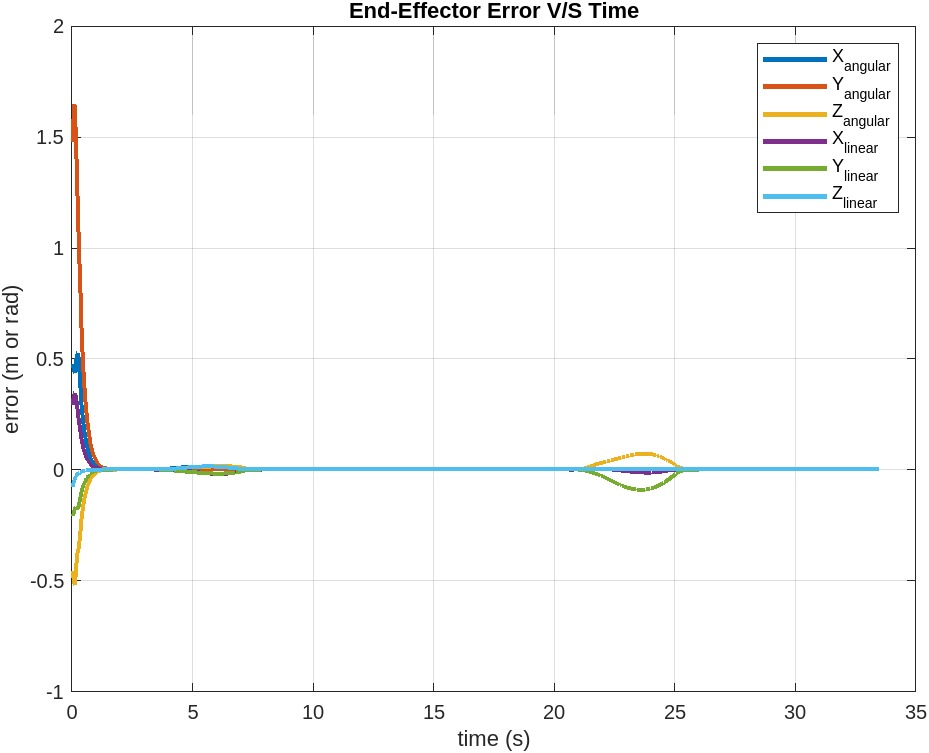

# Mobile Manipulator Pick-and-Place in CoppeliaSim

MATLAB implementation of a feedback-control pipeline for a KUKA youBot-style mobile manipulator performing a cube pick-and-place task in CoppeliaSim.

## What It Does

- Generates an eight-segment end-effector trajectory for approach, grasp, transfer, release, and retreat.
- Simulates chassis, wheel, and arm-joint motion with velocity limiting.
- Uses feedforward plus PI feedback control on SE(3) pose error.
- Converts desired end-effector twist into wheel and joint velocities through the mobile manipulator Jacobian.
- Writes CSV outputs that can be loaded into the CoppeliaSim scene.

## Results At A Glance

| Scenario | Controller | Result |
|---|---|---|
| Best case | `Kp = 4.5 * I`, `Ki = 0` | Fast convergence with stable pick-and-place motion. |
| Overshoot | `Kp = 5 * I`, `Ki = 0.5 * I` | More aggressive response with visible oscillation. |
| New task | `Kp = 3 * I`, `Ki = 0` | Stable completion after changing cube start/end positions. |



More plots and video links are summarized in [`docs/RESULTS.md`](docs/RESULTS.md).

## Repository Structure

```text
src/       MATLAB functions for kinematics, trajectory generation, and control
scripts/   Main runnable project script
tests/     MATLAB validation scripts
outputs/   Generated CSV files, ignored by git
docs/      Report, result plots, reproducibility notes, and project notes
```

## Requirements

- MATLAB or GNU Octave
- CoppeliaSim scene for the Modern Robotics mobile-manipulation capstone / youBot pick-and-place task

## Run

From MATLAB or Octave:

```matlab
run("scripts/run_project.m")
```

Generated files are written to `outputs/`:

- `robot_states_case.csv`
- `error.csv`
- `youbot_simulation.csv` when running `tests/test_next_state.m`

## Quick Check

```matlab
run("tests/run_all_tests.m")
```

This runs lightweight validation scripts for state updates, trajectory shape, transform helpers, and feedback-control output dimensions.

## Report And Evidence

- Final report: [`docs/MAE-204-Final-Report.pdf`](docs/MAE-204-Final-Report.pdf)
- Results summary: [`docs/RESULTS.md`](docs/RESULTS.md)
- Reproducibility notes: [`docs/REPRODUCIBILITY.md`](docs/REPRODUCIBILITY.md)
- Credibility checklist: [`docs/CREDIBILITY_CHECKLIST.md`](docs/CREDIBILITY_CHECKLIST.md)

## Verification Status

The repository cleanup verified file structure, attribution, privacy, README links, and static MATLAB references. Runtime verification was not performed during cleanup because MATLAB and CoppeliaSim were not available in that environment.

## Attribution

Several helper functions follow Modern Robotics textbook/course conventions. See [`NOTICE.md`](NOTICE.md) for details.
