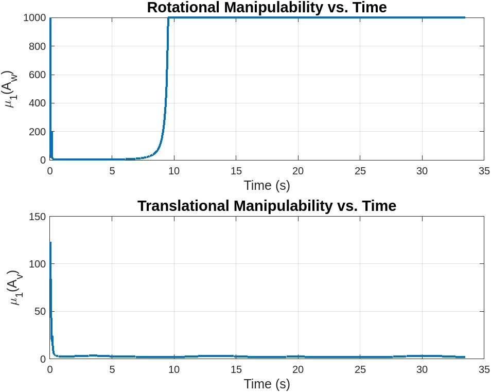
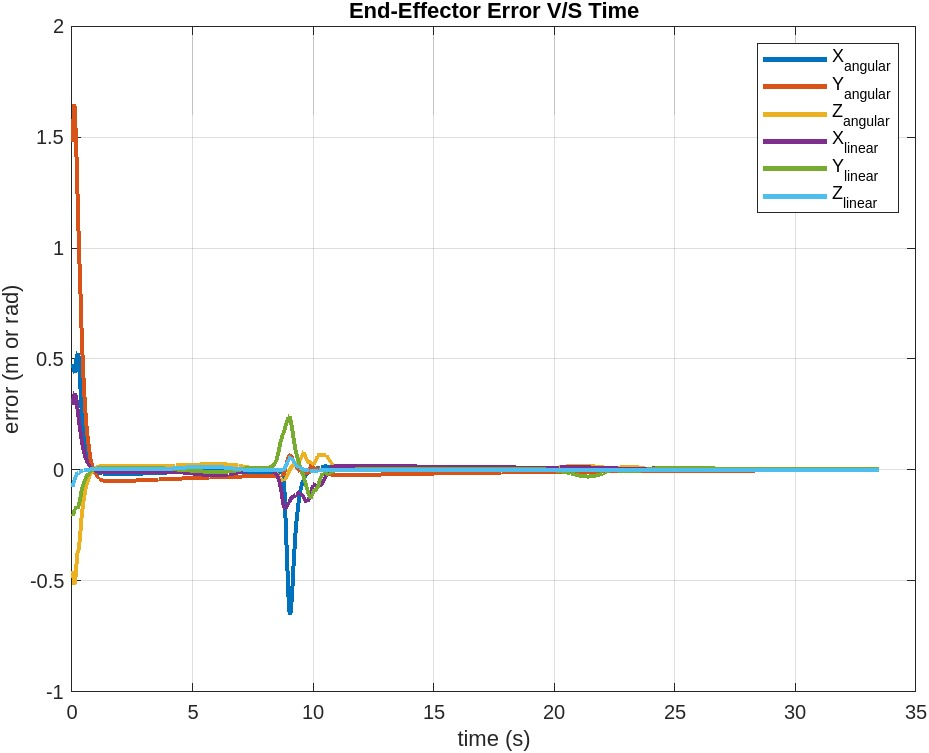
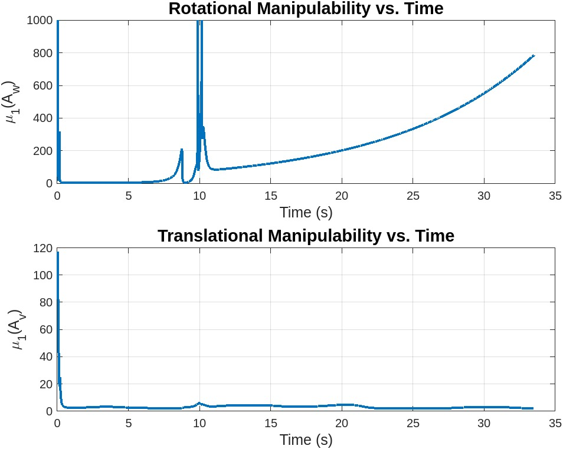
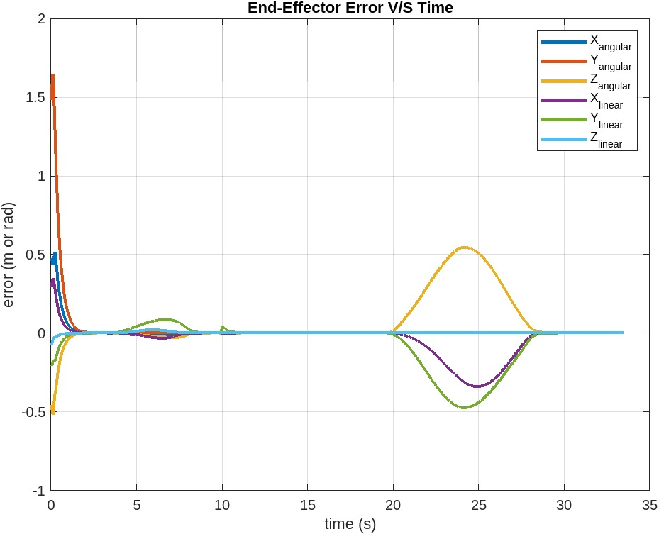
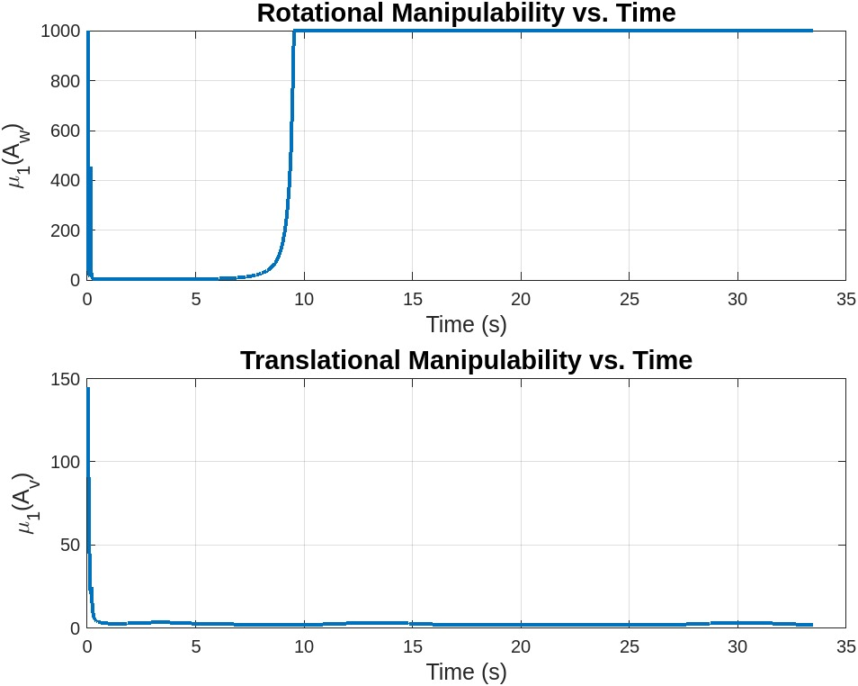

# Results

These results summarize the final report evidence included in
[`MAE-204-Final-Report.pdf`](MAE-204-Final-Report.pdf). The code was not rerun during this repository cleanup because MATLAB and CoppeliaSim were not available in the cleanup environment.

## Scenario Summary

| Scenario | Controller | Task Change | Observed Behavior |
|---|---|---|---|
| Best case | `Kp = 4.5 * I`, `Ki = 0` | Initial end-effector pose includes orientation and position error | Smooth convergence with limited residual error during the main transfer. |
| Overshoot | `Kp = 5 * I`, `Ki = 0.5 * I` | Same initial task as best case | More aggressive transient response and visible oscillation/noise in the error plot. |
| New task | `Kp = 3 * I`, `Ki = 0` | Cube moves from `(1.0, 1.0)` to `(1.0, -1.0)` | Controller adapts to a changed pick-and-place target while avoiding sustained instability. |

## Best Case

The best case uses feedforward plus proportional control with quintic Cartesian interpolation. The error plot shows fast convergence after the initial pose mismatch, with smaller deviations during later motion segments.

Video evidence from the report:
<https://drive.google.com/file/d/1A7Eq8kXwi2qde86xE9eEA-wjLMcVo-u5/view?usp=sharing>

## Overshoot Case

The overshoot case adds integral action. This reduces long-term bias in principle, but the selected `Ki` causes accumulated error to over-correct the motion. The result is a rougher transient response with larger fluctuations.

Video evidence from the report:
<https://drive.google.com/file/d/1RzMuxqmRNKqNhXgmalV32UCi8EZjIgAN/view?usp=sharing>

## New Task

The new task changes the cube's initial and final positions. The controller remains stable enough to complete the motion, though the manipulability plots show momentary dips near less favorable arm configurations.

Video evidence from the report:
<https://drive.google.com/file/d/1uKYs4h3vlvW4OIBwFexzv7B6-fW54Ak7/view?usp=sharing>

## Interpretation

Increasing the integral gain can help reduce steady-state tracking error, but it can also create overshoot when accumulated error remains large after the robot has already approached the target. Low velocity limits can also increase tracking error after grasping because the feedforward term expects the robot to move at the planned trajectory speed.
